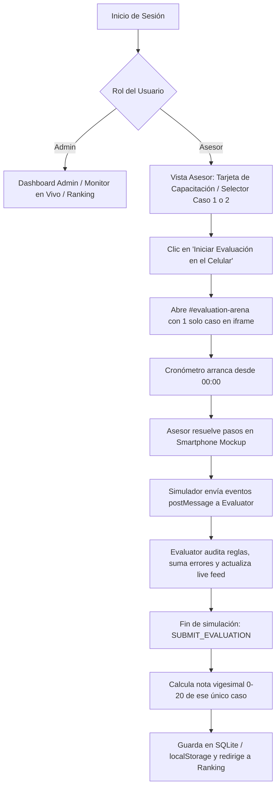

# Documentación de Flujos del Sistema — UYAPAY B2C

> **Propósito del documento:** Este documento registra de manera formal la línea base de los flujos del sistema implementados en el código actual, documenta las observaciones y correcciones solicitadas por el equipo de negocio, y define la arquitectura del **Nuevo Flujo de Evaluación Multi-Caso (5 casos en tabs)** para su posterior implementación.

---

## 1. Contexto y Objetivos de Ajuste

A partir de la revisión técnica del sistema, se identificaron los siguientes puntos clave de corrección respecto a la versión preliminar:

1. **Eliminación del concepto de capacitación en esta fase:** El sistema no aborda material instructivo ni vistas de capacitación previa. El asesor ingresa directamente al entorno de **Evaluación**.
2. **Evaluación de 5 Casos en Pestañas (Tabs):** En lugar de que el asesor elija manualmente un solo caso en un selector desplegable, al presionar **"Iniciar Evaluación"** el sistema cargará una batería de **5 casos prácticos seleccionados del catálogo de 15 disponibles**.
3. **Estructura en Tabs:** La pantalla de evaluación dispondrá de 5 pestañas interactivas (un tab por cada caso asignado), permitiendo evaluar el desempeño integral del asesor en cada escenario.
4. **Permanencia de Componentes Núcleo:** El **cronómetro en tiempo real**, el **motor de evaluación desacoplado**, la **trazabilidad de eventos**, el **monitor en vivo de administración** y el **ranking general con podio** se mantienen plenamente vigentes.

---

## 2. Flujos Actuales (Línea Base en el Código)

A continuación se describe la secuencia técnica que ejecuta el código hoy en el repositorio:

### Diagrama del Flujo Actual (Línea Base)



### Detalle de la Línea Base:
1. **Flujo de Acceso:** Login de usuario (`admin` o `asesor`). El rol asesor abre una vista denominada "Evaluación Práctica" que muestra un selector manual entre Caso 1 y Caso 2.
2. **Flujo de Ejecución Monocaso:** Al presionar "Iniciar", se abre el visor con un único caso cargado en el iframe del simulador móvil (`simulator.html?case=case-X`).
3. **Flujo de Auditoría Desacoplada:** El simulador no calcula notas; emite eventos (`SIMULATOR_EVENT`) hacia `Evaluator.processAction()`. Si hay error, envía toast rojo; si es correcto, avanza de pantalla.
4. **Flujo de Monitoreo Remoto:** Cada evento relevante se envía vía API al backend y se transmite a los administradores mediante *Server-Sent Events (SSE)*.
5. **Flujo de Calificación y Cierre:** Se detiene el cronómetro, se evalúa contra la escala vigesimal ($20 - [\text{errores} \times 4]$) y se almacena el resultado en la base de datos SQLite y `localStorage`.

---

## 3. Observaciones y Correcciones de Negocio

| Elemento | Enfoque Anterior (Línea Base) | Enfoque Corregido (A Implementar) |
|---|---|---|
| **Alcance funcional** | Mezclaba mensajes y títulos de "Módulo de Capacitación" con la evaluación. | **100% Evaluación Práctica.** No hay pantallas ni textos de capacitación; el flujo es directo a la prueba del asesor. |
| **Selección del caso** | Selector manual (`<select>`) donde el asesor elegía evaluar el Caso 1 o el Caso 2. | **Batería de 5 casos seleccionados de los 15 disponibles** del catálogo de negocio de UYAPAY. |
| **Interfaz de resolución** | Un solo visor estático con las instrucciones de un único caso. | **Vista con 5 Pestañas (Tabs 1 al 5):** Cada pestaña contiene las instrucciones y el contexto del caso asignado para evaluar el desempeño. |
| **Cronómetro** | Cronómetro en vivo de evaluación. | **Se mantiene:** Cronómetro único y continuo que contabiliza el tiempo global de resolución de la batería de casos como criterio clave de desempate. |
| **Simulador Móvil** | Smartphone mockup desacoplado con eventos postMessage. | **Se mantiene y adapta:** El simulador responde a las directivas del caso activo según la pestaña seleccionada. |
| **Ranking y Podio** | Ordenamiento por Puntaje $\rightarrow$ Menor Tiempo $\rightarrow$ Menos Errores. | **Se mantiene:** Clasificación dinámica con podio Top 3 y tabla oficial. |

---

## 4. Nuevo Flujo Objetivo (Especificación para Modificación)

### Diagrama del Nuevo Flujo Multi-Caso

```mermaid
flowchart TD
    subgraph Acceso
        N1[Login Asesor / Admin] --> N2{Validación de Rol}
    end

    subgraph Vista_Evaluacion["Vista de Evaluación (Asesor)"]
        N2 -->|Asesor| N3[Vista de Bienvenida a Evaluación Práctica]
        N3 --> N4[Botón: Iniciar Evaluación]
        N4 --> N5[Sistema carga 5 casos de los 15 disponibles]
    end

    subgraph Arena_MultiTab["Arena de Evaluación (5 Tabs)"]
        N5 --> N6[Inicializa Cronómetro Global ⏱️ 00:00]
        N6 --> N7[Renderiza Barra de 5 Tabs: Caso 1 | Caso 2 | Caso 3 | Caso 4 | Caso 5]
        N7 --> N8[Tab 1 Activo: Carga Instrucciones y Prepara Simulador]
        N8 --> N9[Asesor resuelve caso en el Simulador Móvil]
        N9 --> N10{¿Completó Caso del Tab?}
        N10 -->|Sí, siguiente| N11[Habilita / Cambia al Siguiente Tab]
        N11 --> N8
        N10 -->|Completó los 5 casos| N12[Finalizar Evaluación Global]
    end

    subgraph Calificacion_y_Ranking["Consolidación y Ranking"]
        N12 --> N13[Detener Cronómetro Global: Tiempo Total Registrado]
        N13 --> N14[Calcular Desempeño Consolidado de los 5 Casos]
        N14 --> N15[Guardar en SQLite / API REST]
        N15 --> N16[Actualizar Ranking General y Podio Top 3]
        N15 --> N17[Feed en Vivo para Dashboard Admin vía SSE]
    end
```

---

## 5. Descripción Paso a Paso del Nuevo Flujo

### Fase 1: Ingreso Directo a la Evaluación
1. El asesor inicia sesión con su usuario asignado (`alvaro`, `maria`, etc.).
2. El sistema lo posiciona de inmediato en la **Vista de Evaluación**, eliminando cualquier referencia a etapas de capacitación previa.
3. La pantalla presenta las condiciones generales de la prueba:
   - Número de casos a resolver: **5 casos prácticos**.
   - Criterios de evaluación: Cumplimiento estricto del manual UYAPAY, control de errores y tiempo total.
   - Botón de acción principal: **"Iniciar Evaluación"**.

### Fase 2: Generación de la Batería de 5 Casos
1. Al presionar **"Iniciar Evaluación"**:
   - El sistema invoca el servicio de casos y selecciona **5 de los 15 casos disponibles** del catálogo oficial (Casos B2C-01 a B2C-15).
   - Se crea una sesión de evaluación multi-caso en el evaluador (`MultiCaseEvaluation`).
   - Se pone en marcha el **cronómetro global unificado** (`⏱️ 00:00`), el cual no se reinicia entre tabs, midiendo el tiempo acumulado total.

### Fase 3: Navegación y Resolución por Pestañas (Tabs 1 a 5)
1. La arena de evaluación muestra en la parte superior:
   - Cronómetro global (`⏱️ MM:SS`).
   - Indicador de progreso (ej. *Caso 1 de 5*).
   - **Barra de 5 pestañas (Tabs):** `[Caso 1]`, `[Caso 2]`, `[Caso 3]`, `[Caso 4]`, `[Caso 5]`.
   - Cada pestaña muestra el estado del caso: *En progreso*, *Completado* o *Pendiente*.
2. Al seleccionar un Tab:
   - El panel lateral izquierdo actualiza instantáneamente: código del caso, cliente asignado, instrucciones operativas y reglas comerciales esperadas.
   - El smartphone mockup carga o actualiza el simulador móvil contextualizado para ese caso específico.
3. El asesor interactúa con la aplicación móvil en el simulador:
   - Cada clic genera eventos (`SIMULATOR_EVENT`) dirigidos al motor desacoplado.
   - El evaluador audita contra las reglas del caso activo en ese tab.
   - Los errores y aciertos quedan asociados al caso correspondiente.

### Fase 4: Cierre de Caso y Transición entre Tabs
1. Al culminar el flujo de un caso en el smartphone, el simulador emite la confirmación de orden/cierre.
2. El evaluador marca el tab actual como **Completado (✅)** y desbloquea/activa automáticamente el siguiente tab disponible.
3. El asesor puede revisar el estado de sus tabs antes del envío final.

### Fase 5: Consolidación, Calificación y Ranking
1. Al terminar los 5 casos (o al presionar "Finalizar Evaluación"):
   - Se detiene el cronómetro global y se congela el tiempo total.
   - El motor consolida los resultados individuales:
     $$\text{Errores Totales} = \sum_{i=1}^{5} \text{errores}_i$$
     $$\text{Puntaje Global} = \text{Promedio o escala ponderada sobre 20 puntos}$$
   - Se emite el resultado final con desglose caso por caso.
2. El resultado se persiste en SQLite (`/api/results`) y se recalcula el **Ranking General**:
   1. **1° Criterio:** Mayor puntaje global obtenido.
   2. **2° Criterio (Desempate):** Menor tiempo total de resolución.
   3. **3° Criterio (Desempate):** Menor cantidad total de errores.
3. El asesor es redirigido a la vista de **Ranking General & Podio**, donde visualiza su posición oficial y su podio Top 3.
4. El Administrador recibe la actualización en vivo en su panel vía SSE.

---

## 6. Estado de Implementación en el Código

Las modificaciones del nuevo Flujo 2 han sido implementadas y validadas con éxito:

1. **[`index.html`](file:///C:/Users/orfav/Downloads/SOLAR/UYAPAY/B2C/repo/Capacitador-interactivo-UYAPAY/index.html):**
   - Se eliminaron todos los textos y conceptos de "Capacitación", estableciendo una vista directa de evaluación práctica.
   - Se retiró el selector desplegable manual monocaso (`#eval-case-selector`).
   - Se integró la barra de 5 pestañas (`#eval-tabs-bar`) y la navegación de casos con indicadores de estado (`⏳`, `✅`, `⚪`).
2. **[`js/portal.js`](file:///C:/Users/orfav/Downloads/SOLAR/UYAPAY/B2C/repo/Capacitador-interactivo-UYAPAY/js/portal.js):**
   - Función `selectFiveEvaluationCases()`: Carga 5 casos seleccionados de los 15 disponibles.
   - Navegación reactiva entre pestañas (`loadCaseInTab`, `nextTab`, `prevTab`).
   - Sincronización continua del cronómetro y guardado consolidado con desglose caso por caso.
3. **[`js/services/evaluator.js`](file:///C:/Users/orfav/Downloads/SOLAR/UYAPAY/B2C/repo/Capacitador-interactivo-UYAPAY/js/services/evaluator.js):**
   - Soporte para evaluación multi-caso (`startMultiEvaluation`).
   - Cronómetro global unificado continuo.
   - Auditoría y contabilidad de errores individualizada por tab y consolidada para el Ranking General.
4. **[`js/simulator.js`](file:///C:/Users/orfav/Downloads/SOLAR/UYAPAY/B2C/repo/Capacitador-interactivo-UYAPAY/js/simulator.js) y [`simulator.html`](file:///C:/Users/orfav/Downloads/SOLAR/UYAPAY/B2C/repo/Capacitador-interactivo-UYAPAY/simulator.html):**
   - Carga dinámica del cliente objetivo y distractores en la ruta para cualquiera de los 15 casos.
   - Parámetros de producto, volumen y promociones contextualizados según el tab activo.
5. **[`js/data/cases.js`](file:///C:/Users/orfav/Downloads/SOLAR/UYAPAY/B2C/repo/Capacitador-interactivo-UYAPAY/js/data/cases.js):**
   - Los 15 casos del catálogo fueron activados con reglas de validación completas.

