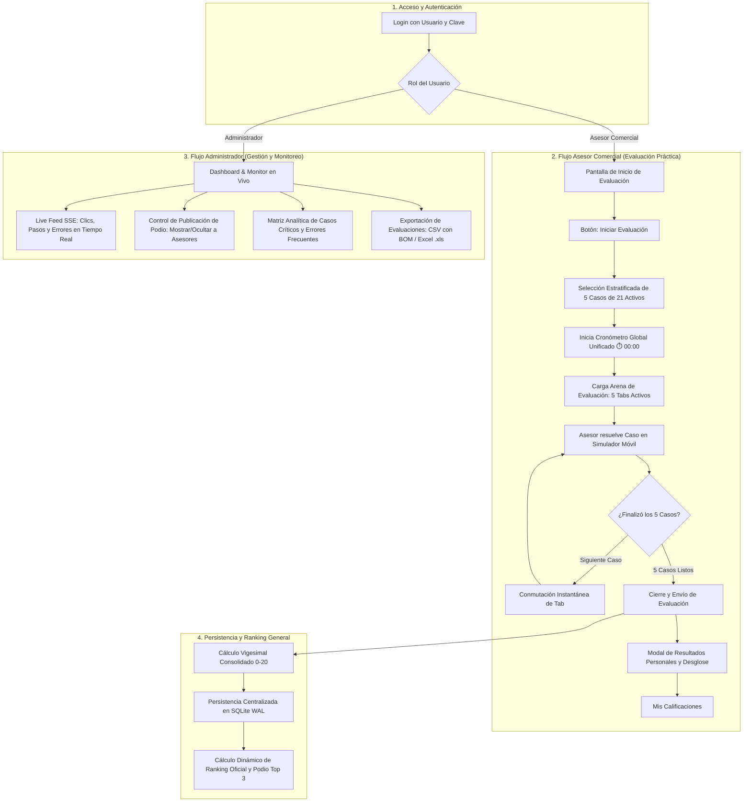

# Documentación de Flujos del Sistema — UYAPAY B2C

> **Propósito del documento:** Este documento registra de manera formal los flujos operativos y la arquitectura del sistema de evaluación práctica implementados en la plataforma UYAPAY B2C, detallando la **Evaluación Multi-Caso en 5 Pestañas (Tabs)**, los 8 flujos del simulador móvil nativo, los criterios de calificación y el monitoreo en vivo.

---

## 1. Contexto y Objetivos del Sistema

A partir de los requerimientos formativos de UYAPAY B2C, el sistema opera bajo los siguientes principios:

1. **Evaluación Práctica Directa:** El asesor no navega por material teórico previo en la plataforma; ingresa directamente al entorno de **Evaluación de Desempeño Práctico**.
2. **Evaluación de 5 Casos en Pestañas (Tabs 1 al 5):** Al presionar **"Iniciar Evaluación"**, el sistema genera una batería de **5 casos prácticos seleccionados del catálogo oficial de 21 casos activos**, organizados en 5 pestañas individuales para evaluar competencias integrales.
3. **Selección Estratificada Balanceada:** La asignación de los 5 casos cubre de forma homogénea las 5 áreas comerciales críticas (Venta base, condiciones de pago/listas, promociones/combos, gestión de ruta y cobranzas/liquidación), con filtro anti-repetición respecto a la última evaluación del asesor.
4. **Arquitectura Desacoplada:** El simulador móvil emula la aplicación Flutter oficial sin conocer la lógica de puntaje; emite eventos (`SIMULATOR_EVENT`) hacia el motor evaluador desacoplado.
5. **Permanencia de Componentes Núcleo:** Cronómetro continuo de desempate, trazabilidad de eventos, monitor en vivo vía SSE, podio con control de publicación y analítica de errores para capacitadores.

---

## 2. Flujo Global del Sistema

---

## 3. Descripción Paso a Paso del Flujo de Evaluación

### Fase 1: Autenticación y Bienvenida
1. El asesor inicia sesión con su cuenta oficial (`alvaro`, `lruiz`, `percy`, etc. con contraseña `123`).
2. El sistema valida las credenciales contra los hashes seguros PBKDF2 almacenados en SQLite.
3. Se despliega la pantalla de bienvenida explicando las reglas de la evaluación:
   - Resolución de 5 casos prácticos en pestañas.
   - Cronómetro continuo acumulado como criterio de desempate.
   - Escala vigesimal (0 a 20) con deducción de 4 puntos por error.

### Fase 2: Batería Balanceada de 5 Casos Estratificados
Al hacer clic en **"Iniciar Evaluación"**, el sistema ejecuta la selección estratégica cubriendo un caso por cada estrato temático:

| Estrato | Área Comercial | Universo de Casos |
|---|---|---|
| **Estrato 1** | Venta Regular y Catálogo Base | `B2C-01`, `B2C-02`, `B2C-03`, `B2C-04` |
| **Estrato 2** | Condiciones Especiales, Listas y Moneda | `B2C-06`, `B2C-08`, `B2C-09`, `B2C-10`, `B2C-11`, `B2C-14` |
| **Estrato 3** | Políticas Promocionales y Descuentos | `B2C-07`, `B2C-20`, `B2C-21` |
| **Estrato 4** | Procedimientos de Ruta, Historial y Excepciones | `B2C-15`, `B2C-16`, `B2C-17`, `B2C-22` |
| **Estrato 5** | Cobranza, Cotizaciones y Cierre Operativo | `B2C-05`, `B2C-18`, `B2C-19`, `B2C-23` |

*Filtro anti-repetición:* El algoritmo prioriza casos que no hayan sido evaluados en el intento inmediato anterior del asesor.

### Fase 3: Resolución Multi-Tab en el Simulador Móvil
1. Se inicializa el cronómetro global (`⏱️ 00:00`), el cual corre ininterrumpidamente durante toda la prueba.
2. El asesor visualiza la barra de 5 pestañas (`Caso 1` a `Caso 5`):
   - **Panel lateral:** Presenta la situación comercial del caso activo, ficha del cliente, dirección y reglas requeridas, sin revelar spoilers ni códigos internos.
   - **Marco Smartphone:** El simulador conmutará en caliente (`PORTAL_SET_CASE`) al caso correspondiente sin recargar el iframe.
3. El simulador móvil soporta 8 flujos de la app real:
   - **Flujo 1:** Plan de visitas y selección de clientes en ruta.
   - **Flujo 2:** Tareas de visita (Inicio, Fotos, Precios, Pedidos, Cobranzas).
   - **Flujo 3:** Configuración de pedidos (Contado/Crédito, Listas de precios, Línea y Marca).
   - **Flujo 4:** Catálogo y detalle de producto con toggle de promoción o descuento.
   - **Flujo 5:** Gestión de cobranza (efectivo, depósito, cheque, registro de voucher y confirmación).
   - **Flujo 6:** Bypass GPS ante visitas fuera de rango geográfico (atención telefónica).
   - **Flujo 7:** Justificación formal de tareas incompletas al cierre de visita.
   - **Flujo 8:** Generación de Cotizaciones (Tipo 3) y comprobantes digitales compartibles.

### Fase 4: Transición y Cierre de Casos
1. Cada acción en el simulador emite un `SIMULATOR_EVENT` auditado por `Evaluator.processAction()`.
2. Al completar satisfactoriamente el flujo de un caso:
   - La pestaña se marca como **Completada (✅)**.
   - Se notifica al monitor SSE del administrador.
   - El sistema avanza automáticamente a la siguiente pestaña pendiente.

### Fase 5: Consolidación, Calificación y Ranking
1. Al pulsar **"Finalizar y Enviar Evaluación"**:
   - Se detiene el cronómetro global registrando la duración exacta (`MM:SS`).
   - Se consolidan los errores acumulados y la nota promedio vigesimal (0 a 20).
   - El registro se almacena de forma persistente en SQLite vía `POST /api/results`.
2. **Modal de Resultados Personales:** Muestra al asesor su nota global, tiempo total, desglose caso por caso y aviso de que el podio oficial será publicado por el administrador.
3. **Control de Podio por Administrador:**
   - Para evitar distracciones durante la prueba grupal, los asesores ven un estado de espera (`Podio Oficial en Espera`).
   - Una vez que todos culminan, el administrador pulsa **"Mostrar Podio a Asesores"** en su panel, transmitiendo la apertura instantánea por SSE.

---

## 4. Criterios Oficiales de Clasificación en el Ranking

El ranking general dinámico se calcula conforme a las reglas `RF-MVP-042` a `RF-MVP-047`:

1. **1° Criterio:** Mayor calificación numérica obtenida ($20 \rightarrow 0$).
2. **2° Criterio (Desempate primario):** Menor tiempo de resolución registrado por el cronómetro.
3. **3° Criterio (Desempate secundario):** Menor cantidad total de errores cometidos.

---

## 5. Estado de Implementación en el Código

| Componente | Archivo Fuente | Estado Actual |
|---|---|---|
| **Catálogo de 21 Casos** | [`js/data/cases.js`](file:///C:/Users/orfav/Downloads/SOLAR/UYAPAY/B2C/repo/Capacitador-interactivo-UYAPAY/js/data/cases.js) | Activo (Casos 1-11, 14-23 con reglas desacopladas y productos Shell/Michelin). |
| **Nómina Oficial** | [`js/data/users.js`](file:///C:/Users/orfav/Downloads/SOLAR/UYAPAY/B2C/repo/Capacitador-interactivo-UYAPAY/js/data/users.js) / [`server.js`](file:///C:/Users/orfav/Downloads/SOLAR/UYAPAY/B2C/repo/Capacitador-interactivo-UYAPAY/server.js) | Activo (15 usuarios asegurados con PBKDF2). |
| **Arena de 5 Tabs** | [`index.html`](file:///C:/Users/orfav/Downloads/SOLAR/UYAPAY/B2C/repo/Capacitador-interactivo-UYAPAY/index.html) / [`js/portal.js`](file:///C:/Users/orfav/Downloads/SOLAR/UYAPAY/B2C/repo/Capacitador-interactivo-UYAPAY/js/portal.js) | Activo (conmutación en caliente sin parpadeo y selección estratificada). |
| **Motor de Evaluación** | [`js/services/evaluator.js`](file:///C:/Users/orfav/Downloads/SOLAR/UYAPAY/B2C/repo/Capacitador-interactivo-UYAPAY/js/services/evaluator.js) | Activo (cronómetro continuo, auditoría desacoplada y consolidación de notas). |
| **Simulador Móvil** | [`js/simulator.js`](file:///C:/Users/orfav/Downloads/SOLAR/UYAPAY/B2C/repo/Capacitador-interactivo-UYAPAY/js/simulator.js) / [`simulator.html`](file:///C:/Users/orfav/Downloads/SOLAR/UYAPAY/B2C/repo/Capacitador-interactivo-UYAPAY/simulator.html) | Activo (8 flujos completos, task carousel de 5 tareas y emisión postMessage). |
| **Backend & SSE** | [`server.js`](file:///C:/Users/orfav/Downloads/SOLAR/UYAPAY/B2C/repo/Capacitador-interactivo-UYAPAY/server.js) | Activo (SQLite WAL, streaming SSE en vivo, exportación CSV UTF-8 BOM y Excel .xls). |
| **Pruebas Automatizadas**| [`test/business_rules.test.js`](file:///C:/Users/orfav/Downloads/SOLAR/UYAPAY/B2C/repo/Capacitador-interactivo-UYAPAY/test/business_rules.test.js) | 27 tests superados (catálogo, desempates, criptografía y endpoints). |

